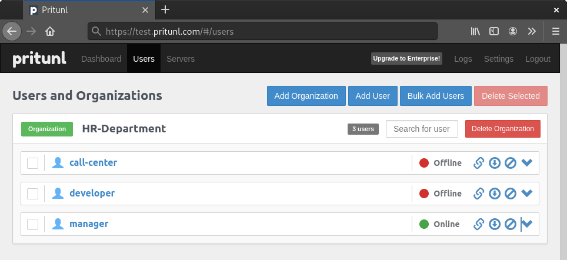

# Ansible for Pritunl

Pritunl is a great web-tool for organize your VPN-server - https://pritunl.com.

You can create "servers" with different networks, "organizations" and "users" with different client vpn-config (with pin code for connection or without it). Logging on the box. Click-click.



I make simple Ansible playbook role for momental deploy `pritunl` to server **based** on Debian 10. 

## Config

Edit access to your server on "../ansible/inventories/hosts.yml".

## Deploy

```bash
ansible-playbook playbooks/server.yml --tags deploy
```

or with Ansible Vault

```bash
ansible-playbook playbooks/server.yml --tags deploy --ask-vault-pass. Th
```

## Disable web of Pritunl

```bash
ansible-playbook playbooks/server.yml --tags localize
```

or with Ansible Vault

```bash
ansible-playbook playbooks/server.yml --tags localize --ask-vault-pass. Th
```

## Enable web on Pritunl

```bash
ansible-playbook playbooks/server.yml --tags globalize
```

or with Ansible Vault

```bash
ansible-playbook playbooks/server.yml --tags globalize --ask-vault-pass
```

## That's all
